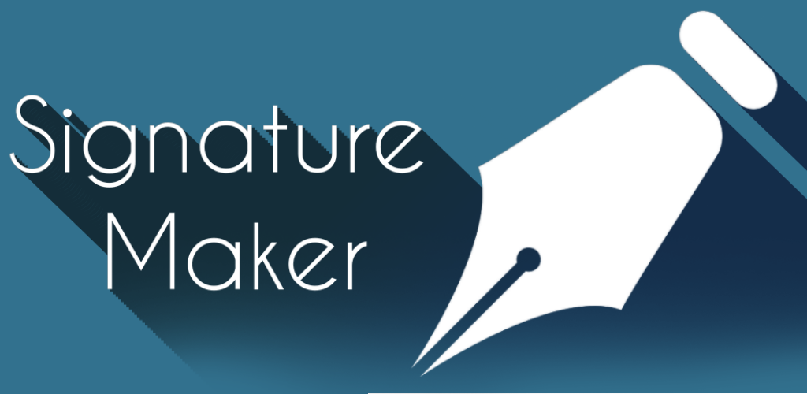

# Signature Maker 2.024

# Index

 • [Description en-EN](https://github.com/rulogarcillan/SignatureMaker/blob/master/README.md#description-en-en)
 
 • [License-en-En](https://github.com/rulogarcillan/SignatureMaker#license-en-en)
 
 • [Descripción es-ES](https://github.com/rulogarcillan/SignatureMaker/blob/master/README.md#descripci%C3%B3n-es-es)
 
 • [Licencia-es-ES](https://github.com/rulogarcillan/SignatureMaker#licencia-es-es)

#Description en-EN

Digitize your signature.

Here we have the new versión of the best app about signatures: SIGNATURE MAKER!
It has a completely new design.
We have taken into account your suggestions and we have introduced some options that you told us. 
The application source  is now free with licence [GNU GPL V3.0] (LICENSE.md)
What are you waiting for donwloading the new version? Signature maker has not got publicity, it is clean and totally free.

 The hard work of printing the document,signing and scaning it has finished.You just have to download Signature Maker.

■  Choose the colour.

■  Choose the stroke.

■  Sign with your finger or stylus.

■  Save and send it to anywhere (Drive, Dropbox,Telegram, Whatsapp, Gmail, Hangouts etc.)

                           NOW, IT'S DONE!!!

You just need to download your digital signature and attach it to the file (Pdf, Word etc...)

 Signature Maker is a complete signature creator and manager, it takes your signature and save it in a transparent image ready to add it to any digital file.

INSTRUCTIONS TO MAKE YOUR OWN STYLUS

Materials:

■  A pencil.

■  Aluminum foil.

Procedure:

Cover the pencil with aluminum foil in order to create contact between the finger, the pencil and the screen.

#License en-EN

Signature Maker is an open-source application totally free, which is located un github with licence  [GNU GPL V3.0] (LICENSE.md)

If you are interested in the project, you can visit this link:

[Signature Maker] (https://github.com/rulogarcillan/SignatureMaker)

#Descripción es-ES

Digitaliza tu firma

 
Ya está aquí la nueva versión de la mejor aplicación de firmas Signature Maker con un diseño completamente nuevo. Hemos escuchado vuestras críticas y hemos implementado algunas opciones que nos habéis solicitado, además el código de la aplicación pasa a ser libre con licencia [GNU GPL V3.0] (LICENSE.md), ¿a qué esperas para descargar la nueva versión? Signature Maker no tiene publicidad, es limpia y totalmente gratuita.

Se acabó el engorroso trabajo de imprimir el documento, firmarlo y escanearlo. Ahora solo necesitas descargarte Signature Maker.

■ Elige un color.

■ Elige un trazo.

■ Firma con tu dedo o stylus.

■ Guarda y envía tu firma digitalizada a cualquier parte (Drive, Dropbox, Telegram, Whatsapp, Gmail, Hangouts etc...)

                           ¡¡¡Listo!!!!

 
Ahora solo tendrás que descargar la firma digital y adjuntarla a tu documento (Pdf, Word etc...)
Signature Maker es un completo creador y gestor de firmas, recoge el trazado de tu rubrica y lo guarda en una imagen trasparente preparada para ser estampada en cualquier documento digital.

MANUAL PARA CREAR TU PROPIO STILUS

Material:

■ Lápiz

■ Papel de plata.
Envuelve el lapicero con una capa de papel de plata para que haga contacto tu dedo, el papel y la pantalla.

#Licencia es-ES

Signature Maker es una aplicación de código abierto totalmente gratuita alojada en github bajo licencia  [GNU GPL V3.0] (LICENSE.md)

Si estás interesado en el proyecto puedes visitar el siguiente enlace:

[Signature Maker] (https://github.com/rulogarcillan/SignatureMaker)
