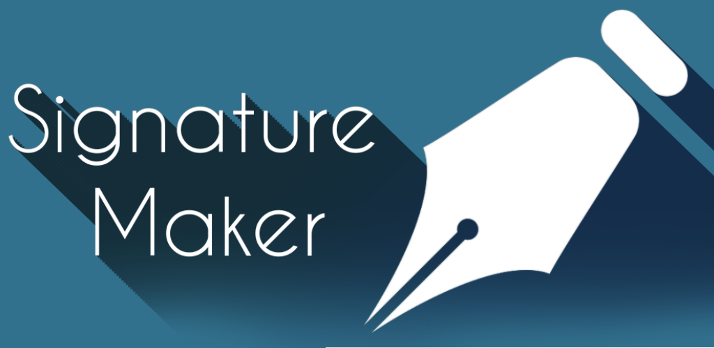

  
  
  # Signature Maker 4.0
  
  ### Digitize your signature with ease
  
  
  
  
  
  

---

## 📑 Table of Contents

- [🇬🇧 English](#english)
  - [Overview](#overview)
  - [Features](#features)
  - [How to Use](#how-to-use)
  - [DIY Stylus](#diy-stylus)
  - [License](#license)
- [🇪🇸 Español](#español)
  - [Descripción](#descripción)
  - [Características](#características)
  - [Cómo Usar](#cómo-usar)
  - [Stylus Casero](#stylus-casero)
  - [Licencia](#licencia-1)

---

## 🇬🇧 English

### Overview

**Signature Maker** is a powerful yet simple Android application designed to digitize your signature effortlessly. Say goodbye to the tedious process of printing, signing, and scanning documents. With Signature Maker, you can create professional digital signatures in seconds and seamlessly integrate them into any digital document.

The application features a completely redesigned interface based on user feedback and is now available as open-source software under the [GNU GPL v3.0](LICENSE.md) license. It's clean, intuitive, and completely free.

### Features

- **🎨 Customizable Colors**: Choose from a wide range of colors for your signature
- **✏️ Adjustable Stroke Width**: Select the perfect stroke thickness for your style
- **👆 Touch & Stylus Support**: Sign naturally with your finger or a stylus
- **💾 Save & Share**: Export your signature with transparent background
- **📤 Multiple Export Options**: Share directly to Drive, Dropbox, Telegram, WhatsApp, Gmail, and more
- **🖼️ PNG Format**: High-quality transparent images ready for document embedding
- **📱 Modern UI**: Clean, intuitive interface designed for ease of use

### How to Use

1. **Select** your preferred color and stroke width
2. **Draw** your signature using your finger or stylus
3. **Save** the signature with a transparent background
4. **Export** to your preferred platform or storage service
5. **Attach** the signature to your PDF, Word, or other digital documents

That's it! Your professional digital signature is ready to use.

### DIY Stylus

Want better precision? Create your own stylus at home:

**Materials Needed:**
- A pencil or pen
- Aluminum foil

**Instructions:**
1. Wrap the pencil/pen tip with aluminum foil
2. Ensure the foil makes continuous contact from your finger to the screen
3. Use your homemade stylus for more precise signatures

### License

Signature Maker is an open-source project distributed under the [GNU GPL v3.0](LICENSE.md) license.

**GitHub Repository:** [https://github.com/rulogarcillan/SignatureMaker](https://github.com/rulogarcillan/SignatureMaker)

Contributions, bug reports, and feature requests are welcome!

---

## 🇪🇸 Español

### Descripción

**Signature Maker** es una potente y sencilla aplicación Android diseñada para digitalizar tu firma sin esfuerzo. Di adiós al tedioso proceso de imprimir, firmar y escanear documentos. Con Signature Maker, puedes crear firmas digitales profesionales en segundos e integrarlas perfectamente en cualquier documento digital.

La aplicación cuenta con una interfaz completamente rediseñada basada en los comentarios de los usuarios y ahora está disponible como software de código abierto bajo la licencia [GNU GPL v3.0](LICENSE.md). Es limpia, intuitiva y completamente gratuita.

### Características

- **🎨 Colores Personalizables**: Elige entre una amplia gama de colores para tu firma
- **✏️ Grosor de Trazo Ajustable**: Selecciona el grosor perfecto para tu estilo
- **👆 Soporte Táctil y Stylus**: Firma de forma natural con tu dedo o un stylus
- **💾 Guardar y Compartir**: Exporta tu firma con fondo transparente
- **📤 Múltiples Opciones de Exportación**: Comparte directamente en Drive, Dropbox, Telegram, WhatsApp, Gmail y más
- **🖼️ Formato PNG**: Imágenes transparentes de alta calidad listas para incrustar en documentos
- **📱 Interfaz Moderna**: Diseño limpio e intuitivo para facilitar su uso

### Cómo Usar

1. **Selecciona** tu color y grosor de trazo preferidos
2. **Dibuja** tu firma usando tu dedo o stylus
3. **Guarda** la firma con fondo transparente
4. **Exporta** a tu plataforma o servicio de almacenamiento preferido
5. **Adjunta** la firma a tus documentos PDF, Word u otros archivos digitales

¡Listo! Tu firma digital profesional está lista para usar.

### Stylus Casero

¿Quieres mayor precisión? Crea tu propio stylus en casa:

**Materiales Necesarios:**
- Un lápiz o bolígrafo
- Papel de aluminio

**Instrucciones:**
1. Envuelve la punta del lápiz/bolígrafo con papel de aluminio
2. Asegúrate de que el papel aluminio haga contacto continuo desde tu dedo hasta la pantalla
3. Usa tu stylus casero para firmas más precisas

### Licencia

Signature Maker es un proyecto de código abierto distribuido bajo la licencia [GNU GPL v3.0](LICENSE.md).

**Repositorio GitHub:** [https://github.com/rulogarcillan/SignatureMaker](https://github.com/rulogarcillan/SignatureMaker)

¡Las contribuciones, reportes de errores y solicitudes de nuevas funciones son bienvenidas!

---

  
### Made with ❤️ by the Open Source Community

**[⬆ Back to Top](#signature-maker-40)**

